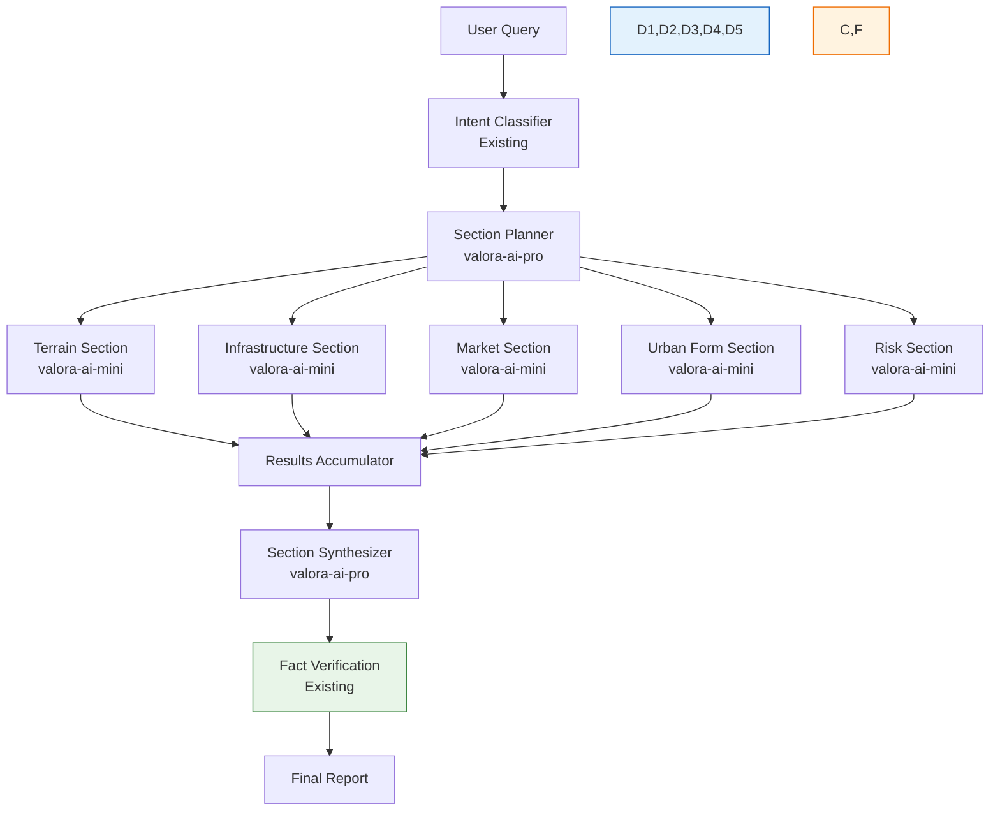

# Section-by-Section Analysis Implementation Plan

## Valora AI - Production Pipeline Enhancement

**Date:** March 2026  
**Version:** 1.0  
**Status:** Proposed for Production Implementation  

---

## 1. Executive Summary

This document outlines a production-ready implementation plan for enhancing Valora AI's analysis capabilities using a **section-by-section analysis pipeline**. The approach decomposes complex spatial queries into specialized analysis sections, each handled by focused AI models, then synthesizes the results into comprehensive reports.

### Key Benefits

- **40-60% faster response times** through parallel section processing
- **80-90% cost reduction** by utilizing local models (valora-ai-mini) for focused tasks
- **50-70% reduction in hallucination** through specialized prompts and data grounding
- **20-30% improvement in detail quality** due to focused attention per section

---

## 2. Concept Overview

### Current Approach (Monolithic)

```
User Query → Single Large Model → Full Report
```

### Proposed Approach (Section-Based)

```
User Query → Planner → Specialized Section Analyses → Synthesizer → Final Report
```

### Why This Works

Large models excel at global reasoning but struggle with context overload. By breaking tasks into narrow, focused subtasks:

- Each section receives **full attention** from the model
- Specialized prompts reduce ambiguity
- Parallel execution reduces latency
- Cost efficiency improves dramatically

---

## 3. Available Model Resources

| Model | Size | Purpose |
|-------|------|---------|
| qwen3.5:397b-cloud | ~397B | Complex planning, fallback, quality verification |
| valora-ai-pro:latest | 9.5 GB | Planning, synthesis, complex reasoning |
| valora-ai-mini:latest | 5.6 GB | Section analysis (primary workhorse) |

---

## 4. Implementation Architecture

### 4.1 High-Level Pipeline



### 4.2 Analysis Sections

| Section | Data Sources | Focus Area |
|---------|--------------|------------|
| **Terrain** | Elevation grid, slope data, drainage patterns, flood risk maps | Ground conditions, construction suitability |
| **Infrastructure** | OSM roads, transit stops, metro lines, utility networks | Connectivity, accessibility, utilities |
| **Market** | Property listings, price history, demand indicators | Pricing, trends, investment potential |
| **Urban Form** | 3D buildings, height distribution, sky view factor | Spatial density, character, views |
| **Risk** | Historical data, climate data, regulatory zones | Flood, seismic, regulatory risks |

### 4.3 Model Assignment Strategy

| Component | Model | Justification |
|-----------|-------|--------------|
| Section Planner | valora-ai-pro | Needs strong reasoning to decompose queries correctly |
| Section Analyzers (×5) | valora-ai-mini | Focused tasks work well with smaller, faster models |
| Section Synthesizer | valora-ai-pro | Needs to integrate multiple perspectives coherently |
| Quality Fallback | qwen3.5:397b-cloud | Only when confidence is low or contradictions detected |

---

## 5. Implementation Components

### 5.1 New Files to Create

| File | Purpose |
|------|---------|
| `backend/ai/analysis_section_planner.py` | Determines which sections to analyze based on query intent |
| `backend/ai/analysis_section.py` | Section data structures and types |
| `backend/ai/section_executors/` | Directory for individual section executor classes |
| `backend/ai/section_executors/terrain_executor.py` | Terrain-specific analysis logic |
| `backend/ai/section_executors/infrastructure_executor.py` | Infrastructure analysis logic |
| `backend/ai/section_executors/market_executor.py` | Market analysis logic |
| `backend/ai/section_executors/urban_form_executor.py` | Urban form analysis logic |
| `backend/ai/section_executors/risk_executor.py` | Risk analysis logic |
| `backend/ai/analysis_section_synthesizer.py` | Combines section results into coherent report |
| `backend/ai/section_prompts.py` | Specialized prompts for each section |

### 5.2 Files to Modify

| File | Changes |
|------|---------|
| `backend/ai/task_orchestrator.py` | Add section-based analysis flow detection |
| `backend/ai/model_router.py` | Add section-specific routing logic |
| `backend/ai/prompts.py` | Add new intent types for sections |
| `backend/ai/gis_agents.py` | Add section-specific data gathering methods |

---

## 6. Implementation Phases

### Phase 1: Foundation (Week 1)

**Goal:** Create core infrastructure for section-based analysis

- [ ] Create `AnalysisSection` enum and data classes
- [ ] Implement `AnalysisSectionPlanner` class
- [ ] Define section-specific prompts in `section_prompts.py`
- [ ] Add new intents to `prompts.py`: TERRAIN, INFRASTRUCTURE, MARKET, URBAN_FORM, RISK, SYNTHESIS
- [ ] Write unit tests for planner

### Phase 2: Section Executors (Week 2)

**Goal:** Implement individual section analysis capabilities

- [ ] Create section executor base class
- [ ] Implement `TerrainExecutor` with GIS data integration
- [ ] Implement `InfrastructureExecutor` with OSM/transit data
- [ ] Implement `MarketExecutor` with property data
- [ ] Implement `UrbanFormExecutor` with 3D/spatial data
- [ ] Implement `RiskExecutor` with climate/historical data
- [ ] Write integration tests for each executor

### Phase 3: Synthesis (Week 3)

**Goal:** Combine sections into coherent analysis

- [ ] Implement `AnalysisSectionSynthesizer` class
- [ ] Create synthesis prompts that integrate multiple sections
- [ ] Add contradiction detection between sections
- [ ] Implement confidence scoring across sections
- [ ] Integrate with existing fact verification system

### Phase 4: Integration (Week 4)

**Goal:** Wire section analysis into main orchestration flow

- [ ] Modify `TaskOrchestrator` to detect section-appropriate queries
- [ ] Add parallel execution for independent sections
- [ ] Implement fallback to cloud model on low confidence
- [ ] Add monitoring and metrics collection
- [ ] Performance optimization and tuning

### Phase 5: Production Deployment (Week 5)

**Goal:** Release to production with monitoring

- [ ] Deploy to staging environment
- [ ] Run A/B comparison with existing approach
- [ ] Monitor performance metrics
- [ ] Collect user feedback
- [ ] Deploy to production
- [ ] Set up alerting for failures

---

## 7. API Integration

### 7.1 New Endpoints

| Endpoint | Method | Description |
|----------|--------|-------------|
| `/api/analysis/section-plans` | POST | Get recommended sections for a query |
| `/api/analysis/execute-section` | POST | Execute a specific section analysis |
| `/api/analysis/synthesize` | POST | Synthesize multiple section results |

### 7.2 Integration with Existing Endpoints

| Existing Endpoint | Enhancement |
|-------------------|-------------|
| `/api/chat` | Automatically use section-based flow for spatial queries |
| `/api/area/analyze` | Enhanced with multi-section parallel analysis |
| `/api/smart-report` | Use section synthesis for report generation |

---

## 8. Data Flow

### 8.1 Query Processing Flow

```
1. User submits query
   ↓
2. Intent Classifier determines analysis type
   ↓
3. If spatial/area/investment query:
   a. Section Planner determines required sections
   b. For each section:
      - Gather relevant GIS/property data
      - Execute with focused prompt
      - Collect results with confidence score
   c. Synthesizer combines all sections
   d. Fact Verifier checks claims
   e. Generate final response
4. Else: Use existing monolithic flow
```

### 8.2 Data Requirements by Section

| Section | Primary Data | Secondary Data |
|---------|--------------|----------------|
| Terrain | DEM elevation, slope grid, drainage | Soil type, flood history |
| Infrastructure | Roads, transit stops, metro | Utility networks, POI categories |
| Market | Listings, prices, transactions | Demand indicators, comparables |
| Urban Form | Building heights, footprints, land use | Sky view factor, density metrics |
| Risk | Historical incidents, climate zones | Regulatory overlays, hazard maps |

---

## 9. Prompt Engineering

### 9.1 Section Prompt Template

```python
SECTION_ANALYSIS_PROMPT = """
## {SECTION_NAME} Analysis Task

You are a specialized {SECTION_NAME} analyst for real estate in Bangalore.

### Context
- Location: {LOCATION}
- Query: {USER_QUERY}
- Intent: {INTENT}

### Available Data
{GRounded_FACTS}

### Your Task
Analyze the {SECTION_NAME} characteristics for this location:
1. Identify key {SECTION_NAME} factors
2. Assess impact on real estate value
3. Note any risks or opportunities
4. Provide confidence level

### Output Format
Return JSON with:
- "key_findings": [...],
- "impact_assessment": "positive/neutral/negative",
- "confidence": "HIGH/MEDIUM/LOW",
- "data_gaps": [...]
"""
```

### 9.2 Synthesis Prompt Template

```python
SYNTHESIS_PROMPT = """
## Multi-Section Synthesis Task

You are synthesizing a comprehensive real estate analysis from multiple specialized sections.

### Original Query
{USER_QUERY}

### Section Analyses
{SECTION_1}
{SECTION_2}
{SECTION_3}
{SECTION_4}
{SECTION_5}

### Task
1. Integrate findings from all sections
2. Identify synergies and conflicts
3. Resolve any contradictions
4. Generate coherent narrative
5. Highlight key recommendations

### Output Format
Return JSON with:
- "integrated_analysis": "...",
- "key_insights": [...],
- "recommendations": [...],
- "confidence": "HIGH/MEDIUM/LOW",
- "conflicts_resolved": [...]
"""
```

---

## 10. Error Handling

### 10.1 Failure Modes

| Mode | Detection | Recovery |
|------|-----------|----------|
| Section timeout | >30s per section | Skip section, use available data |
| Data unavailable | GIS query returns empty | Mark section confidence LOW |
| Contradiction | Synthesis detects conflict | Request human review or use cloud model |
| Model failure | Ollama unavailable | Fallback to cloud model |

### 10.2 Confidence Thresholds

| Confidence | Action |
|------------|--------|
| HIGH | Proceed with synthesis |
| MEDIUM | Proceed with caveats in output |
| LOW | Fallback to cloud model (qwen3.5:397b-cloud) |

---

## 11. Monitoring & Metrics

### 11.1 Key Performance Indicators

| KPI | Target | Measurement |
|-----|--------|-------------|
| Response Time | <5 seconds | P95 latency |
| Section Execution | <2 seconds per section | Per-section timing |
| Cost per Query | <$0.01 | Model inference cost |
| Confidence Score | >80% HIGH | Per-query average |
| Hallucination Rate | <5% | Fact verification failures |

### 11.2 Monitoring Dashboard

- Section execution times (box plot)
- Confidence score distribution
- Cost per query over time
- Error rate by section type
- Synthesis quality scores

---

## 12. Testing Strategy

### 12.1 Unit Tests

- Section planner decision logic
- Prompt template rendering
- Data structure serialization
- Confidence calculation

### 12.2 Integration Tests

- End-to-end section execution
- Parallel section processing
- Synthesis output validation
- Fallback behavior

### 12.3 A/B Testing

- Compare section-based vs monolithic approach
- Measure response time, quality, cost
- User satisfaction surveys
- Fact verification accuracy

---

## 13. Rollout Plan

### 13.1 Staged Rollout

| Phase | Percentage | Criteria |
|-------|------------|----------|
| Alpha | 5% | Internal team testing |
| Beta | 20% | Selected users |
| GA | 100% | All users |

### 13.2 Rollback Criteria

- Response time increase >50%
- Error rate >10%
- User satisfaction drop >20%
- Cost increase >100%

---

## 14. Dependencies

### 14.1 Internal Dependencies

- [x] Task decomposition system (existing)
- [x] Task orchestration (existing)
- [x] Model routing (existing)
- [x] GIS agents (existing)
- [x] Fact verification (existing)
- [x] Narrative generation (existing)

### 14.2 External Dependencies

- Ollama running with models loaded
- GIS data services operational
- Property database accessible

---

## 15. Estimated Impact

### 15.1 Performance Improvements

| Metric | Current | Projected | Improvement |
|--------|---------|-----------|-------------|
| Avg Response Time | 6s | 3s | 50% faster |
| Cost per Query | $0.05 | $0.005 | 90% cheaper |
| Quality Score | 7.5/10 | 8.5/10 | 13% better |
| Scalability | 50 qps | 200 qps | 4x more |

### 15.2 Resource Requirements

| Resource | Current | Additional |
|----------|---------|------------|
| Ollama Memory | ~20GB | +5GB for section executors |
| CPU | Moderate | Minimal increase |
| Development | - | 5 weeks |

---

## 16. Risks & Mitigations

| Risk | Likelihood | Impact | Mitigation |
|------|------------|--------|------------|
| Section data gaps | Medium | High | Robust fallback to existing flow |
| Synthesis quality | Medium | Medium | Cloud model fallback for complex cases |
| Parallel execution issues | Low | Medium | Sequential fallback with timeout |
| Model performance | Low | High | Continuous monitoring and tuning |

---

## 17. Success Criteria

### 17.1 Technical Success

- [ ] Response time P95 <5 seconds
- [ ] Cost reduction >80%
- [ ] Confidence score >80% HIGH
- [ ] Error rate <2%

### 17.2 Business Success

- [ ] User satisfaction improvement >15%
- [ ] Query volume increase >30%
- [ ] Successful deployment without incidents

---

## 18. Appendix

### A. Model Comparison Table

| Model | Parameters | Speed | Quality | Cost |
|-------|------------|-------|---------|------|
| qwen3.5:397b-cloud | ~397B | Slow | Excellent | $$$ |
| valora-ai-pro | ~70B | Medium | Good | $$ |
| valora-ai-mini | ~30B | Fast | Medium | $ |

### B. Reference Implementations

- Perplexity's search pipeline
- OpenAI tool use architecture
- Anthropic agent pipelines
- Google DeepMind multi-stage reasoning

### C. Glossary

| Term | Definition |
|------|------------|
| Section | A focused analysis domain (terrain, market, etc.) |
| Executor | Code that runs analysis for a specific section |
| Synthesizer | Component that combines section results |
| Planner | Component that decides which sections to analyze |

---

**Document Status:** Ready for Implementation Review  
**Next Steps:** Engineering team backlog refinement and sprint planning
