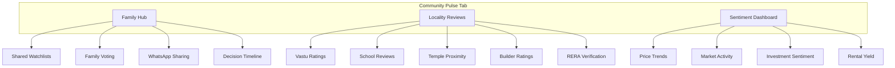
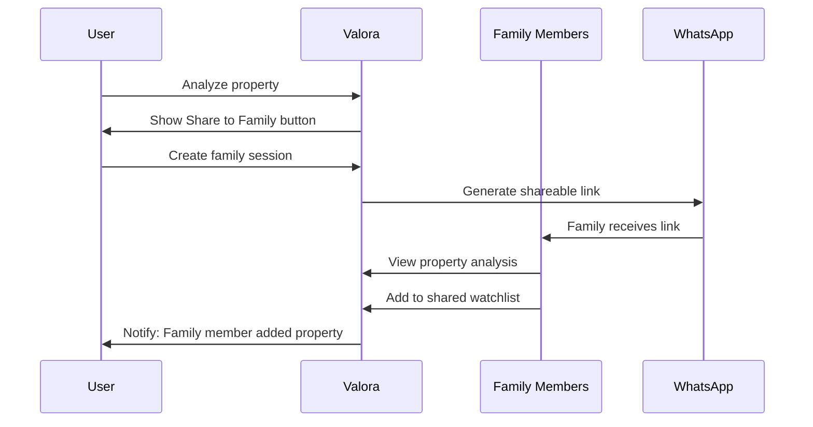
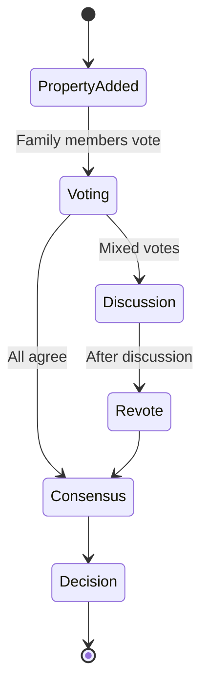
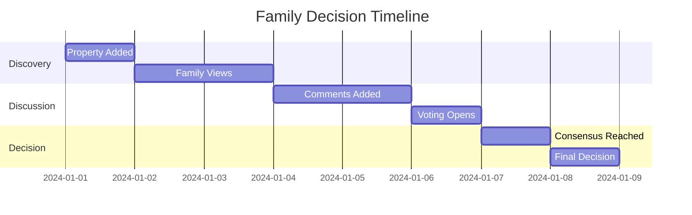
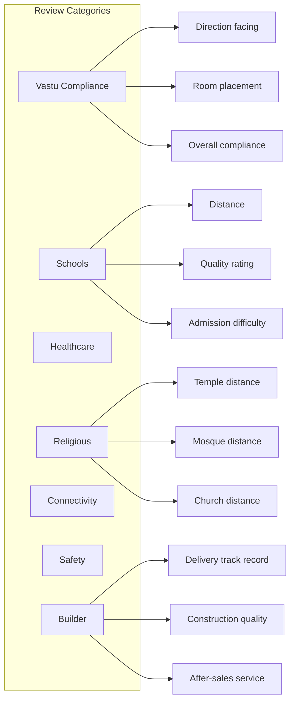
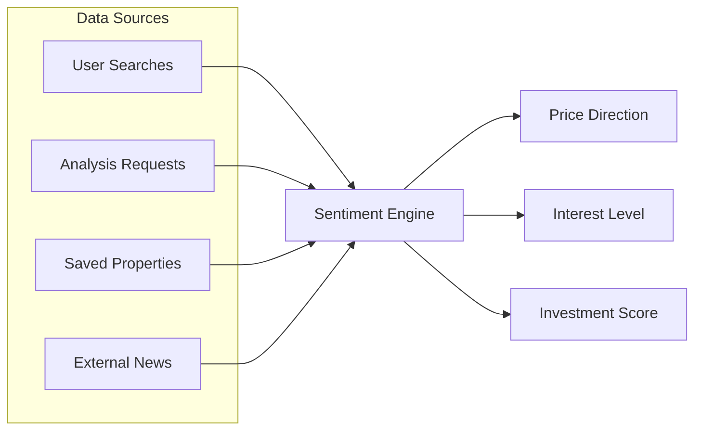
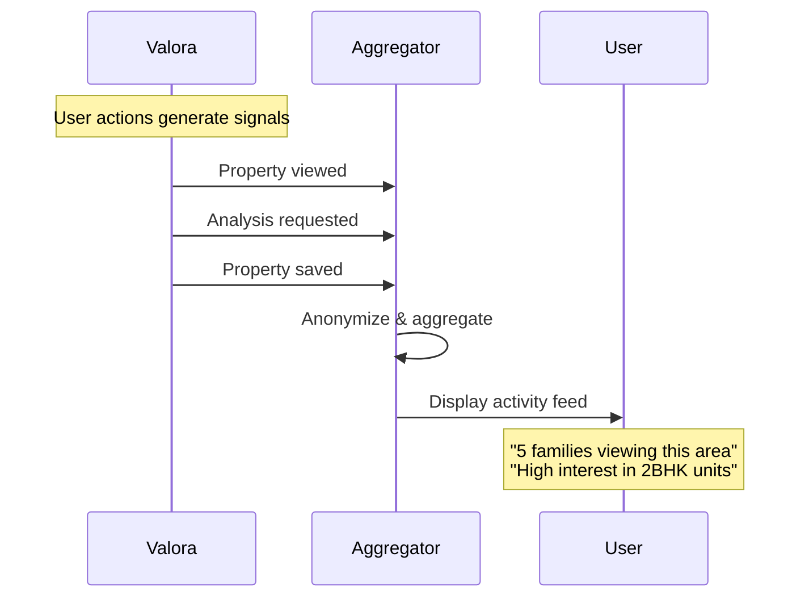
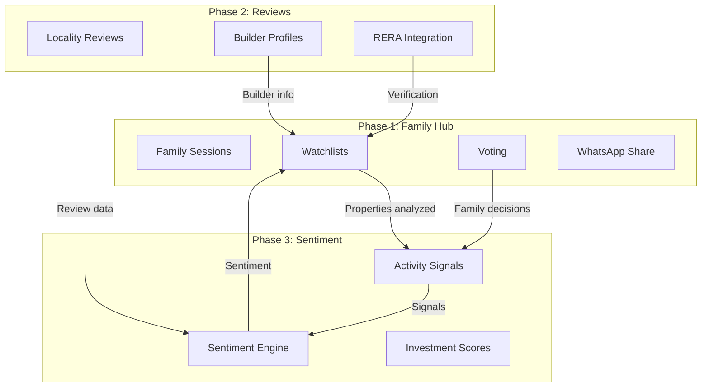
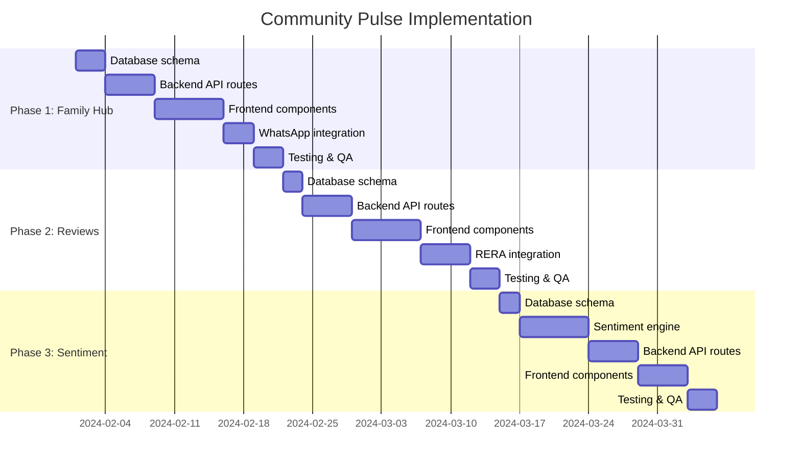

# Community Pulse Feature Roadmap

## Executive Summary

This roadmap outlines the implementation of a **Community Pulse** tab for Valora's SmartPanel, designed specifically for the Indian real estate market. The feature combines family collaboration, locality reviews, and market sentiment to create a differentiated, trust-building experience.

---

## Feature Overview



---

## Phase 1: Foundation - Family Hub

### Business Rationale
- **Primary Driver**: Joint family decisions are the norm in India
- **Viral Potential**: Family sharing creates network effects
- **Conversion Path**: Free family collaboration → Premium family features

### Features

#### 1.1 Shared Watchlists


**Data Model:**
```sql
CREATE TABLE family_sessions (
    id TEXT PRIMARY KEY,
    owner_user_id TEXT NOT NULL,
    family_name TEXT,
    created_at TIMESTAMP DEFAULT CURRENT_TIMESTAMP,
    settings JSON DEFAULT '{}'
);

CREATE TABLE family_members (
    id INTEGER PRIMARY KEY,
    session_id TEXT NOT NULL,
    user_id TEXT,
    email TEXT,
    phone TEXT,
    role TEXT DEFAULT 'member', -- 'owner', 'admin', 'member'
    invited_at TIMESTAMP,
    joined_at TIMESTAMP,
    FOREIGN KEY (session_id) REFERENCES family_sessions(id)
);

CREATE TABLE family_watchlist (
    id INTEGER PRIMARY KEY,
    session_id TEXT NOT NULL,
    property_id TEXT,
    locality TEXT,
    lat REAL,
    lng REAL,
    added_by TEXT NOT NULL,
    added_at TIMESTAMP DEFAULT CURRENT_TIMESTAMP,
    notes TEXT,
    FOREIGN KEY (session_id) REFERENCES family_sessions(id)
);
```

#### 1.2 Family Voting System


**Data Model:**
```sql
CREATE TABLE family_votes (
    id INTEGER PRIMARY KEY,
    session_id TEXT NOT NULL,
    property_id TEXT NOT NULL,
    user_id TEXT NOT NULL,
    vote TEXT CHECK(vote IN ('thumbs_up', 'thumbs_down', 'maybe')),
    aspects JSON, -- {"location": 5, "price": 4, "amenities": 3}
    comment TEXT,
    created_at TIMESTAMP DEFAULT CURRENT_TIMESTAMP,
    UNIQUE(session_id, property_id, user_id)
);
```

#### 1.3 WhatsApp Integration
- Generate shareable deep links
- Pre-filled message templates
- Property summary card for sharing
- Track share analytics

#### 1.4 Decision Timeline


### API Endpoints

```python
# backend/routes/family_routes.py

# Session Management
POST   /api/family/session                    # Create family session
GET    /api/family/session/{id}               # Get session details
PUT    /api/family/session/{id}               # Update session settings
DELETE /api/family/session/{id}               # Delete session

# Member Management
POST   /api/family/session/{id}/invite        # Invite family member
POST   /api/family/session/{id}/join          # Accept invitation
DELETE /api/family/session/{id}/member/{uid}  # Remove member

# Watchlist
POST   /api/family/session/{id}/watchlist     # Add property to watchlist
GET    /api/family/session/{id}/watchlist     # Get watchlist
DELETE /api/family/session/{id}/watchlist/{pid} # Remove property

# Voting
POST   /api/family/session/{id}/vote          # Submit vote
GET    /api/family/session/{id}/votes/{pid}   # Get votes for property
GET    /api/family/session/{id}/consensus/{pid} # Get consensus status

# Sharing
POST   /api/family/session/{id}/share         # Generate share link
GET    /api/family/share/{token}              # Access shared session
```

### Frontend Components

```
src/components/
├── community/
│   ├── FamilyHub.jsx              # Main family hub container
│   ├── FamilySessionCreate.jsx    # Create new family session
│   ├── FamilyInviteModal.jsx      # Invite family members
│   ├── FamilyWatchlist.jsx        # Shared property list
│   ├── FamilyVoteCard.jsx         # Individual vote display
│   ├── FamilyVotingPanel.jsx      # Voting interface
│   ├── FamilyTimeline.jsx         # Decision timeline
│   ├── WhatsAppShare.jsx          # WhatsApp sharing component
│   └── FamilyConsensusBadge.jsx   # Consensus indicator
```

### Tier Configuration

| Feature | Free | Pro |
|---------|------|-----|
| Create family session | ✅ | ✅ |
| Max family members | 3 | Unlimited |
| Max properties in watchlist | 5 | Unlimited |
| Voting system | ✅ | ✅ |
| Decision timeline | Basic | Advanced |
| WhatsApp sharing | ✅ | ✅ |
| AI synthesis of family preferences | ❌ | ✅ |
| Export family decision report | ❌ | ✅ |

---

## Phase 2: Locality Reviews

### Business Rationale
- **Trust Building**: Community reviews counter broker bias
- **India-Specific**: Vastu, temples, schools are unique concerns
- **Content Generation**: User-generated content improves SEO

### Features

#### 2.1 India-Specific Review Categories



#### 2.2 Review Data Model

```sql
CREATE TABLE locality_reviews (
    id INTEGER PRIMARY KEY,
    user_id TEXT NOT NULL,
    locality_id TEXT NOT NULL,
    property_id TEXT,
    
    -- Overall rating
    overall_rating INTEGER CHECK(overall_rating >= 1 AND overall_rating <= 5),
    
    -- India-specific categories
    vastu_rating INTEGER CHECK(vastu_rating >= 1 AND vastu_rating <= 5),
    vastu_facing TEXT, -- 'north', 'east', 'west', 'south'
    vastu_notes TEXT,
    
    -- Amenities
    school_rating INTEGER,
    school_nearest TEXT,
    school_distance_km REAL,
    
    hospital_rating INTEGER,
    hospital_nearest TEXT,
    hospital_distance_km REAL,
    
    temple_distance_km REAL,
    mosque_distance_km REAL,
    
    -- Connectivity
    metro_distance_km REAL,
    railway_distance_km REAL,
    bus_stop_distance_km REAL,
    
    -- Lifestyle
    safety_rating INTEGER,
    noise_level TEXT, -- 'quiet', 'moderate', 'noisy'
    cleanliness_rating INTEGER,
    
    -- Builder (if applicable)
    builder_name TEXT,
    builder_rating INTEGER,
    builder_delivery_on_time BOOLEAN,
    builder_quality_rating INTEGER,
    
    -- Text review
    review_title TEXT,
    review_text TEXT,
    
    -- Verification
    is_verified_resident BOOLEAN,
    residency_duration_months INTEGER,
    
    -- Engagement
    helpful_count INTEGER DEFAULT 0,
    report_count INTEGER DEFAULT 0,
    
    created_at TIMESTAMP DEFAULT CURRENT_TIMESTAMP,
    updated_at TIMESTAMP DEFAULT CURRENT_TIMESTAMP
);

CREATE TABLE review_helpful (
    id INTEGER PRIMARY KEY,
    review_id INTEGER NOT NULL,
    user_id TEXT NOT NULL,
    created_at TIMESTAMP DEFAULT CURRENT_TIMESTAMP,
    UNIQUE(review_id, user_id)
);
```

#### 2.3 Builder Rating System

```sql
CREATE TABLE builder_profiles (
    id INTEGER PRIMARY KEY,
    name TEXT NOT NULL UNIQUE,
    logo_url TEXT,
    website TEXT,
    established_year INTEGER,
    projects_completed INTEGER,
    
    -- Aggregated ratings
    overall_rating REAL,
    delivery_rating REAL,
    quality_rating REAL,
    value_rating REAL,
    
    -- RERA info
    rera_registered BOOLEAN,
    rera_id TEXT,
    
    created_at TIMESTAMP DEFAULT CURRENT_TIMESTAMP
);

CREATE TABLE builder_reviews (
    id INTEGER PRIMARY KEY,
    builder_id INTEGER NOT NULL,
    user_id TEXT NOT NULL,
    project_name TEXT,
    
    delivery_on_time BOOLEAN,
    delivery_delay_months INTEGER,
    construction_quality INTEGER,
    value_for_money INTEGER,
    after_sales_service INTEGER,
    
    review_text TEXT,
    
    created_at TIMESTAMP DEFAULT CURRENT_TIMESTAMP,
    FOREIGN KEY (builder_id) REFERENCES builder_profiles(id)
);
```

#### 2.4 RERA Integration

```python
# backend/services/rera_service.py

class RERAService:
    """Service to verify RERA registration status"""
    
    STATE_RERA_URLS = {
        'maharashtra': 'https://maharera.mahaonline.gov.in',
        'karnataka': 'https://rera.karnataka.gov.in',
        'delhi': 'https://rera.delhi.gov.in',
        'telangana': 'https://rerat.telangana.gov.in',
        # ... all states
    }
    
    async def verify_project(self, rera_id: str, state: str) -> dict:
        """Verify RERA registration and get project details"""
        pass
    
    async def get_project_status(self, rera_id: str) -> dict:
        """Get current project status, complaints, etc."""
        pass
```

### API Endpoints

```python
# backend/routes/review_routes.py

# Locality Reviews
POST   /api/reviews/locality                  # Submit locality review
GET    /api/reviews/locality/{id}             # Get reviews for locality
PUT    /api/reviews/locality/{id}             # Update review
DELETE /api/reviews/locality/{id}             # Delete review
POST   /api/reviews/locality/{id}/helpful     # Mark helpful
POST   /api/reviews/locality/{id}/report      # Report review

# Builder Reviews
POST   /api/reviews/builder                   # Submit builder review
GET    /api/reviews/builder/{id}              # Get builder profile + reviews
GET    /api/reviews/builders/search           # Search builders

# RERA
GET    /api/rera/verify/{rera_id}             # Verify RERA ID
GET    /api/rera/project/{rera_id}            # Get project details
```

### Frontend Components

```
src/components/
├── community/
│   ├── LocalityReviews.jsx         # Reviews container
│   ├── ReviewCard.jsx              # Individual review display
│   ├── ReviewForm.jsx              # Submit review form
│   ├── ReviewFilter.jsx            # Filter by category
│   ├── VastuRating.jsx             # Vastu-specific rating
│   ├── BuilderProfile.jsx          # Builder profile card
│   ├── BuilderReviewForm.jsx       # Builder review form
│   ├── RERAVerification.jsx        # RERA status badge
│   └── ReviewSummary.jsx           # Aggregated ratings display
```

### Tier Configuration

| Feature | Free | Pro |
|---------|------|-----|
| View reviews | ✅ | ✅ |
| Submit reviews | ✅ | ✅ |
| Earn credits for reviews | ✅ | ✅ 2x |
| Builder reviews | View only | Full access |
| RERA verification | Basic | Detailed report |
| Review analytics | ❌ | ✅ |

---

## Phase 3: Sentiment Dashboard

### Business Rationale
- **Investment Focus**: Indian buyers are investment-oriented
- **Market Timing**: "Is this the right time to buy?" is a common question
- **Data Monetization**: Aggregated sentiment is valuable for premium users

### Features

#### 3.1 Price Sentiment Analysis



#### 3.2 Market Activity Feed



#### 3.3 Investment Sentiment Score

```javascript
const sentimentScore = {
  // 0-100 score
  overall: 72,
  
  // Components
  components: {
    price_momentum: 65,      // Price trend direction
    search_volume: 78,       // User interest
    inventory_level: 45,     // Supply availability
    time_on_market: 82,      // Properties selling fast?
    rental_yield: 68,        // Investment return
    infrastructure: 75       // Development activity
  },
  
  // Trend
  trend: 'improving', // 'improving', 'stable', 'declining'
  change_30d: +5,
  
  // Recommendation
  recommendation: 'Good time to buy',
  confidence: 0.75
}
```

#### 3.4 Data Model

```sql
CREATE TABLE market_sentiment (
    id INTEGER PRIMARY KEY,
    locality_id TEXT NOT NULL,
    recorded_at TIMESTAMP DEFAULT CURRENT_TIMESTAMP,
    
    -- Price sentiment
    price_direction TEXT, -- 'rising', 'stable', 'falling'
    price_change_30d REAL,
    price_change_90d REAL,
    
    -- Activity metrics
    views_7d INTEGER,
    analyses_7d INTEGER,
    saves_7d INTEGER,
    
    -- Inventory
    active_listings INTEGER,
    new_listings_7d INTEGER,
    avg_time_on_market_days INTEGER,
    
    -- Computed scores
    interest_score INTEGER, -- 0-100
    investment_score INTEGER, -- 0-100
    overall_sentiment INTEGER, -- 0-100
    
    -- Rental data
    avg_rent_per_sqft REAL,
    rental_yield REAL,
    
    UNIQUE(locality_id, DATE(recorded_at))
);

CREATE TABLE sentiment_signals (
    id INTEGER PRIMARY KEY,
    locality_id TEXT,
    property_id TEXT,
    signal_type TEXT, -- 'view', 'analysis', 'save', 'share'
    user_id_hash TEXT, -- Anonymized
    metadata JSON,
    created_at TIMESTAMP DEFAULT CURRENT_TIMESTAMP
);
```

### API Endpoints

```python
# backend/routes/sentiment_routes.py

GET    /api/sentiment/locality/{id}           # Get sentiment for locality
GET    /api/sentiment/locality/{id}/history   # Historical sentiment
GET    /api/sentiment/locality/{id}/activity  # Activity feed
GET    /api/sentiment/investment-score/{id}   # Investment score
GET    /api/sentiment/trending                # Trending localities
POST   /api/sentiment/signal                  # Record signal (internal)
```

### Frontend Components

```
src/components/
├── community/
│   ├── SentimentDashboard.jsx      # Main dashboard
│   ├── SentimentGauge.jsx          # Visual gauge component
│   ├── ActivityFeed.jsx            # Activity stream
│   ├── InvestmentScore.jsx         # Investment score card
│   ├── PriceTrendChart.jsx         # Price trend visualization
│   ├── TrendingLocalities.jsx      # Trending areas list
│   └── MarketInsightCard.jsx       # Insight summary card
```

### Tier Configuration

| Feature | Free | Pro |
|---------|------|-----|
| View basic sentiment | ✅ | ✅ |
| Activity feed | Limited (7 days) | Full (30 days) |
| Investment score | ✅ | ✅ |
| Historical trends | ❌ | ✅ |
| Price predictions | ❌ | ✅ |
| Market reports | ❌ | ✅ |
| API access | ❌ | ✅ |

---

## Dependencies & Integration Points



### Shared Components

| Component | Used By | Description |
|-----------|---------|-------------|
| `CommunityPulseTab.jsx` | All | Main tab container |
| `ShareButton.jsx` | FH, LR | Generic share component |
| `RatingStars.jsx` | LR, SD | Reusable rating display |
| `ActivityBadge.jsx` | All | Activity indicator |
| `VerifiedBadge.jsx` | LR, FH | Verification status |

### Database Migration Order

```sql
-- 1. Family Hub tables
CREATE TABLE family_sessions (...);
CREATE TABLE family_members (...);
CREATE TABLE family_watchlist (...);
CREATE TABLE family_votes (...);

-- 2. Review tables
CREATE TABLE locality_reviews (...);
CREATE TABLE builder_profiles (...);
CREATE TABLE builder_reviews (...);
CREATE TABLE review_helpful (...);

-- 3. Sentiment tables
CREATE TABLE market_sentiment (...);
CREATE TABLE sentiment_signals (...);
```

---

## Credit System Integration

### Earning Credits

| Action | Credits | Notes |
|--------|---------|-------|
| Create family session | +5 | One-time |
| Invite family member | +3 per invite | When they join |
| Submit verified locality review | +10 | After verification |
| Submit builder review | +8 | After moderation |
| Mark review helpful | +1 | To reviewer |
| Family reaches consensus | +15 | Bonus for completion |

### Spending Credits

| Action | Credits | Tier Alternative |
|--------|---------|------------------|
| View detailed sentiment | 5 | Free for Pro |
| Export family report | 20 | Free for Pro |
| Access historical trends | 10 | Free for Pro |
| Priority review listing | 15 | Pro reviews auto-prioritized |

---

## Implementation Timeline



---

## Success Metrics

### Phase 1: Family Hub
- % of users who create family sessions
- Average family size
- % of properties shared
- Consensus rate
- WhatsApp share click-through rate

### Phase 2: Reviews
- Number of reviews submitted
- Review quality score (helpful marks)
- Builder profile coverage
- RERA verification usage
- Review conversion to property views

### Phase 3: Sentiment
- Sentiment accuracy (vs. actual price changes)
- Investment score correlation with user decisions
- Activity feed engagement
- Premium conversion from sentiment features

---

## Risk Mitigation

| Risk | Mitigation |
|------|------------|
| Fake reviews | Verification requirements, moderation queue, user reputation |
| Privacy concerns | Anonymization, opt-out options, clear data policies |
| Low engagement | Credit incentives, gamification, social proof |
| WhatsApp policy changes | Multiple share channels, in-app sharing |
| RERA API changes | Fallback to manual verification, caching |

---

## Next Steps

1. **Review and approve this roadmap**
2. **Switch to Code mode** to implement Phase 1: Family Hub
3. **Create database migrations** for family_sessions, family_members, family_watchlist, family_votes
4. **Build backend API routes** for family management
5. **Create frontend components** for Family Hub
6. **Integrate WhatsApp sharing**
7. **Test and deploy Phase 1**
8. **Proceed to Phase 2: Locality Reviews**

---

*Document created: 2024-02-24*
*Last updated: 2024-02-24*
