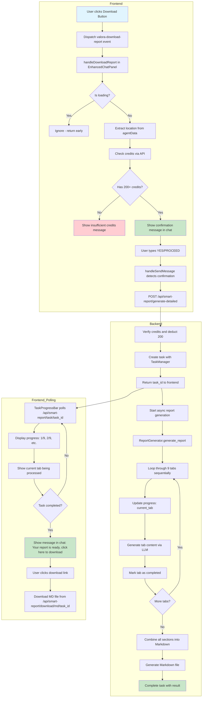
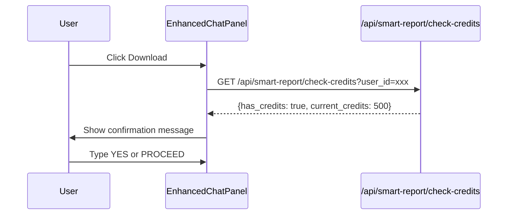
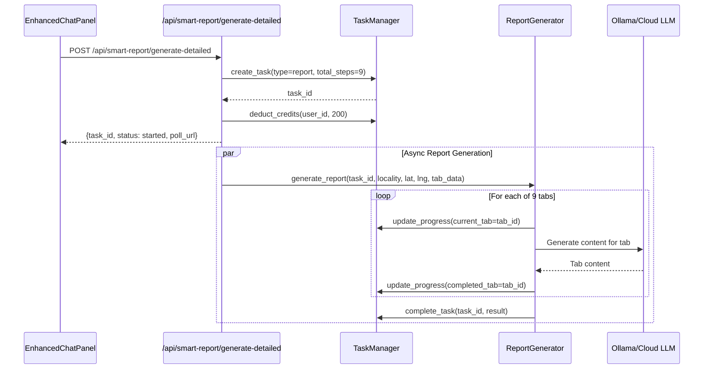
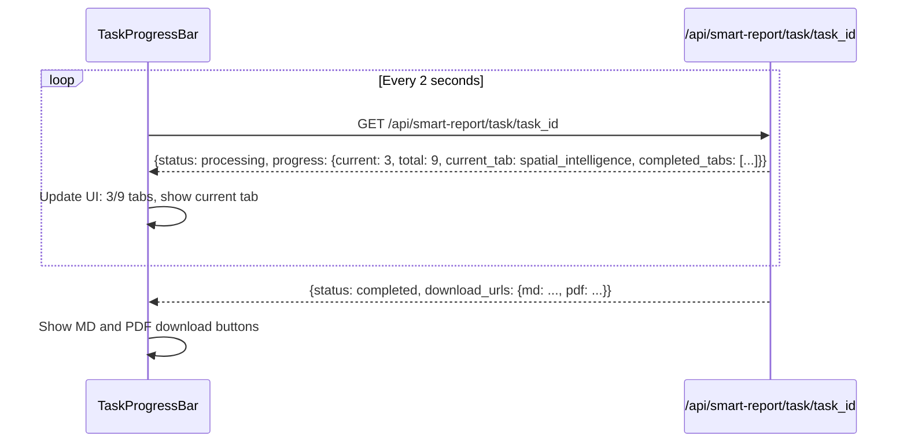
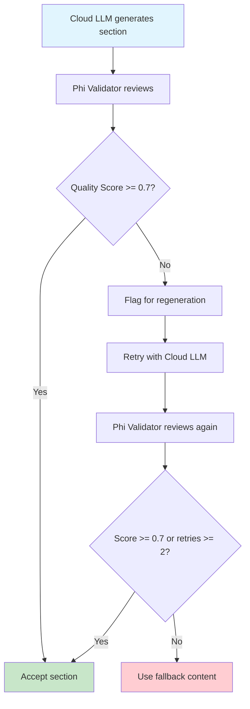

# Download Button Flow Architecture

## Overview

When the user clicks the **Download button** to generate a detailed investment report, a multi-step process is triggered that involves the frontend chat interface, task progress tracking, backend report generation, and LLM-powered content creation.

**Note**: This document describes the report download flow. The simple chat export feature is separate and not covered here.

---

## Complete Flow Diagram



---

## Detailed Component Breakdown

### 1. Download Detailed Report Flow

- **Trigger**: Custom event `valora-download-report`
- **Handler**: [`handleDownloadReport`](src/components/chat/EnhancedChatPanel.jsx:605)
- **Credits Required**: 200

---

### 2. Report Generation Flow

#### Phase 1: Credit Check and Confirmation


#### Phase 2: Task Creation and Async Generation


#### Phase 3: Progress Polling and Download


---

### 3. The 9 Report Tabs

The report generation processes these tabs sequentially:

| # | Tab ID | Display Name | Description |
|---|--------|--------------|-------------|
| 1 | `decision_verdict` | Decision Verdict | Investment recommendation with confidence score |
| 2 | `market_snapshot` | Market Snapshot | Price trends, demand/supply, rental yield |
| 3 | `spatial_intelligence` | Spatial Intelligence | Nearby infrastructure, POIs, walkability |
| 4 | `risk_analysis` | Risk Analysis | Flood, legal, market, infrastructure risks |
| 5 | `roi_projection` | ROI Projection | 3-year projections, entry/exit strategy |
| 6 | `comparables` | Comparables | Similar properties and price analysis |
| 7 | `strategy` | Strategy | Investment strategy and action items |
| 8 | `data_transparency` | Data Transparency | Data sources and verification status |
| 9 | `client_pitch` | Client Pitch | Summary for client presentation |

---

### 4. Key Components

#### Frontend Components

| Component | File | Purpose |
|-----------|------|---------|
| [`EnhancedChatPanel`](src/components/chat/EnhancedChatPanel.jsx) | src/components/chat/EnhancedChatPanel.jsx | Main chat UI, handles download event, shows "report ready" message |
| [`TaskProgressBar`](src/components/TaskProgressBar.jsx) | src/components/TaskProgressBar.jsx | Shows progress 1/9, 2/9, etc. with tab names |

#### Backend Components

| Component | File | Purpose |
|-----------|------|---------|
| [`smart_report_routes.py`](backend/routes/smart_report_routes.py) | backend/routes/smart_report_routes.py | API endpoints for report generation |
| [`ReportGenerator`](backend/services/report_generator.py) | backend/services/report_generator.py | Generates each tab via LLM |
| [`TaskManager`](backend/services/task_manager.py) | backend/services/task_manager.py | Progress tracking and task state |

---

### 5. API Endpoints

| Endpoint | Method | Purpose |
|----------|--------|---------|
| `/api/smart-report/check-credits` | GET | Check if user has 200+ credits |
| `/api/smart-report/generate-detailed` | POST | Start report generation, returns task_id |
| `/api/smart-report/task/{task_id}` | GET | Poll task status and progress |
| `/api/smart-report/download/md/{task_id}` | GET | Download Markdown report |
| `/api/smart-report/cancel/{task_id}` | POST | Cancel running task |

---

### 6. Task Progress Response Structure

```json
{
  "task_id": "task_abc123",
  "status": "processing",
  "progress": {
    "current": 3,
    "total": 9,
    "percentage": 33.3,
    "current_tab": "spatial_intelligence",
    "completed_tabs": ["decision_verdict", "market_snapshot"],
    "message": "Processing Spatial Intelligence...",
    "estimated_remaining_seconds": 120
  }
}
```

---

### 7. Error Handling

- **Insufficient Credits**: Shows error message in chat
- **Task Failure**: TaskProgressBar shows failed state with error message
- **Tab Generation Failure**: Continues with other tabs, logs error
- **Network Errors**: Retry logic in polling, user can retry

---

### 8. User Experience Flow

1. User clicks Download button (or triggers via map interaction)
2. System checks credits
3. If credits sufficient, shows confirmation message in chat
4. User types YES or PROCEED
5. TaskProgressBar appears showing:
   - Circular progress indicator
   - Current tab being processed (e.g., "Processing: Spatial Intelligence")
   - Progress text (e.g., "3 of 9 tabs")
   - Estimated time remaining
   - Checklist of completed tabs
6. When complete:
   - **Message appears in chat panel**: "Your report is ready, click here to download"
   - User clicks the link to download the report (MD or PDF)

---

## Summary

The download button triggers a sophisticated multi-step process:

1. **Credit verification** - Ensures user has 200 credits
2. **User confirmation** - Shows detailed breakdown before proceeding
3. **Task creation** - Creates trackable task with unique ID
4. **Sequential tab processing** - LLM generates content for each of 9 tabs
5. **Real-time progress** - Frontend polls every 2 seconds for updates
6. **Report consolidation** - All tabs combined into Markdown file
7. **Download delivery** - Message appears in chat panel: "Your report is ready, click here to download"

---

## Business Alignment Analysis

### Simplified Two-Tier Model: Free + Pro Only

| Report Tab | Free Tier | Pro ($19/mo) |
|------------|-----------|--------------|
| Decision Verdict | ✅ Limited | ✅ Full |
| Market Snapshot | ✅ Basic | ✅ Full |
| Spatial Intelligence | ❌ Locked | ✅ Full |
| Risk Analysis | ❌ Locked | ✅ Full |
| ROI Projection | ❌ Locked | ✅ Full |
| Comparables | ❌ Locked | ✅ Full |
| Strategy | ❌ Locked | ✅ Full |
| Data Transparency | ✅ Basic | ✅ Full |
| Client Pitch | ❌ Locked | ✅ Full |

### Revenue Impact

The report generation flow directly supports the simplified business model:

1. **Free Users** → See locked tabs (7 of 9) → Upgrade prompt → **Pro conversion**
2. **Pro Users** → Full access to all 9 report tabs → **Complete value delivery**

### Credit System Alignment

- **200 credits per report** for Pro users
- Free: 50 queries/month (basic verdict + market snapshot only)
- Pro: 500 queries/month (full 9-tab reports)

### Why Two Tiers Work Better

1. **Simpler pricing** - Easier decision for users (Free or $19)
2. **Clear upgrade path** - All locked tabs unlock with Pro
3. **Higher conversion** - Lower barrier ($19 vs $299)
4. **Complete value** - Pro users get everything, no "premium" features held back
5. **Faster growth** - Focus on volume at $19/mo rather than niche $299 segment

### Upgrade Triggers

```
Free User Experience:
- Click "Risk Analysis" → "Upgrade to Pro to unlock"
- Click "ROI Projection" → "Upgrade to Pro to unlock"
- Click "Client Pitch" → "Upgrade to Pro to unlock"
- Query limit reached → "Upgrade to Pro for 500 queries"

Pro User Experience:
- All 9 tabs unlocked
- Full detailed reports
- 500 queries/month
- Priority support
```

The MD report download delivers complete value to Pro users without complexity.

---

## Quality Validation Layer Architecture

### Overview

A local Phi model validates each generated report section before delivery, ensuring quality without additional cloud costs.



### Validation Checks by Phi Model

| Check | Description | Weight |
|-------|-------------|--------|
| **Markdown Formatting** | Valid headers, lists, tables | 15% |
| **Section Completeness** | All 10 required sections present | 25% |
| **Numerical Consistency** | Prices, percentages, distances make sense | 20% |
| **Factual Grounding** | Claims match input data | 20% |
| **Content Quality** | No repetition, coherent sentences | 20% |

### Implementation

```python
# Quality validation prompt for Phi
QUALITY_CHECK_PROMPT = """
Review this report section for quality. Score each criterion 0-1:

SECTION: {tab_id}
CONTENT:
{content}

INPUT DATA USED:
{input_data}

Score these criteria:
1. MARKDOWN_FORMAT: Are headers, lists, tables properly formatted?
2. COMPLETENESS: Are all required subsections present?
3. NUMERICAL_ACCURACY: Do numbers match input data? Any hallucinated stats?
4. FACTUAL_GROUNDING: Are claims supported by input data?
5. CONTENT_QUALITY: Is writing clear, no repetition, professional?

Return JSON: {{"scores": {{"markdown": X, "completeness": X, "numerical": X, "factual": X, "quality": X}}, "overall": X, "issues": ["issue1", ...]}}
"""
```

### Model Selection

| Task | Model | Reason |
|------|-------|--------|
| Report Generation | `kimi-k2.5:cloud` / `deepseek-r1:cloud` | Premium quality |
| Quality Validation | `phi-4:latest` (local) | Fast, efficient, no cost |
| Fallback Content | Template-based | No LLM needed |

### Flow Integration

1. Cloud LLM generates section content
2. Phi validates within 2-3 seconds
3. If score < 0.7, regenerate (max 2 retries)
4. If still failing, use template fallback
5. Log quality scores for monitoring

### Benefits

- **Zero marginal cost** - Phi runs locally
- **Fast validation** - 2-3 seconds per section
- **Consistent quality** - Every section validated
- **Automatic improvement** - Poor outputs regenerated
- **Monitoring** - Track quality scores over time

---

## Report Content Improvement Suggestions

### Current State Analysis

The existing prompts in [`report_generator.py`](backend/services/report_generator.py:18) are functional but can be enhanced for better business value.

### Recommended Content Improvements by Tab

#### 1. Decision Verdict Tab

**Current**: Basic verdict with reasoning
**Add**:
- Price negotiation leverage points (what to argue with seller)
- Deal-breaker red flags to watch for
- Optimal holding period recommendation
- Exit strategy timing (when to sell)

#### 2. Market Snapshot Tab

**Current**: Price trends, demand/supply
**Add**:
- Micro-market comparison (how this area compares to adjacent areas)
- New launch pipeline (upcoming projects that may affect prices)
- Rental demand from specific employers (IT parks nearby)
- Price segmentation (budget vs premium in the area)

#### 3. Spatial Intelligence Tab

**Current**: POIs, walkability scores
**Add**:
- Commute time to major employment hubs (Electronic City, Whitefield)
- Metro phase expansion impact timeline
- School admission season timing (Feb-March for Bangalore)
- Last-mile connectivity assessment

#### 4. Risk Analysis Tab

**Current**: Generic risk categories
**Add**:
- BBMP/Khata status verification checklist
- BDA/BMRDA approval requirements
- Encumbrance certificate guidance
- RERA registration verification steps
- Specific documents to request from seller

#### 5. ROI Projection Tab

**Current**: Basic ROI scenarios
**Add**:
- Capital gains tax implications (short-term vs long-term)
- Home loan tax benefits breakdown
- Stamp duty and registration cost estimates
- Rental income tax treatment

#### 6. Comparables Tab

**Current**: Similar properties list
**Add**:
- Recent actual transaction prices (not just asking prices)
- Time on market for comparable properties
- Price negotiation patterns (average discount from asking)
- Builder reputation and track record

#### 7. Strategy Tab

**Current**: Generic action items
**Add**:
- Week-by-week action timeline
- Document collection checklist with deadlines
- Home loan pre-approval timeline
- Registration process steps

#### 8. Data Transparency Tab

**Current**: Data sources list
**Add**:
- Per-metric confidence score (price: 85%, rental: 70%)
- Data freshness indicators (last updated: X days ago)
- Missing data impact assessment

#### 9. Client Pitch Tab

**Current**: Basic selling points
**Add**:
- Lifestyle narrative (morning walks in park, kids school nearby)
- Social proof (notable residents, companies in area)
- Future vision (upcoming infrastructure in 2-3 years)
- FOMO element (limited inventory at this price point)

### Content Quality Enhancements

| Current | Improved |
|---------|----------|
| "Good connectivity" | "15 min to Metro, 25 min to Airport" |
| "High demand" | "45 active buyers per 100 listings" |
| "Good schools nearby" | "5 schools within 2km: Delhi Public School (1.2km), NPS (1.8km)" |

### Implementation Priority

| Priority | Tab | Improvement | User Impact |
|----------|-----|-------------|-------------|
| P0 | Decision Verdict | Negotiation points | Immediate buyer value |
| P0 | Risk Analysis | Legal checklist | Reduces buyer risk |
| P1 | ROI Projection | Tax implications | Financial clarity |
| P1 | Comparables | Transaction evidence | Price confidence |
| P2 | Spatial Intelligence | Commute analysis | Daily life impact |
| P2 | Strategy | Timeline with milestones | Actionable guidance |
