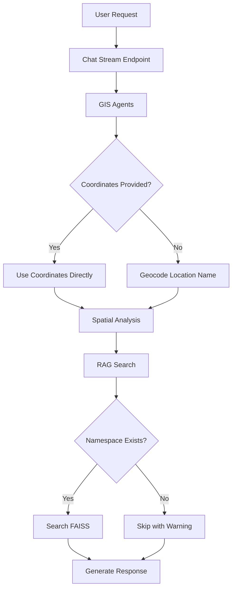

# Valora Performance Improvement Plan

## Executive Summary

Based on log analysis, several performance bottlenecks have been identified that impact the user experience. This plan outlines specific improvements to reduce latency and improve responsiveness.

---

## Identified Bottlenecks

### 1. **Embedding Model Loading - ~13 seconds at startup**

**Issue:** The `sentence-transformers` model `all-MiniLM-L6-v2` takes ~13 seconds to load during startup.

```
[backend] [2026-02-16 20:19:49] INFO  faiss.loader | Loading faiss with AVX2 support.
[backend] [2026-02-16 20:20:02] INFO  sentence_transformers.SentenceTransformer | Load pretrained...
```

**Impact:** Slow server startup and initial request latency.

**Solutions:**
- **A. Lazy Loading:** Defer model loading until first embedding request
- **B. Model Caching:** Pre-cache the model on disk after first load
- **C. Smaller Model:** Consider `all-MiniLM-L4-v2` (faster, slightly less accurate)
- **D. Warm-up Endpoint:** Add startup warm-up that pre-loads the model

---

### 2. **Missing FAISS Namespaces - 4 warnings per request**

**Issue:** The `semantic_search()` function queries 4 namespaces that don't exist:

```python
# backend/ai/rag_service.py:374
namespaces = ["properties", "pois", "places", "transport"]
```

Each missing namespace triggers a warning and returns empty results:

```
[backend] [WARNING] Namespace 'properties' not found
[backend] [WARNING] Namespace 'pois' not found
[backend] [WARNING] Namespace 'places' not found
[backend] [WARNING] Namespace 'transport' not found
```

**Impact:** Unnecessary processing, log noise, and potential confusion.

**Solutions:**
- **A. Check Namespace Existence:** Before searching, check if namespace exists
- **B. Index Missing Data:** Run the FAISS indexing script to populate namespaces
- **C. Dynamic Namespace List:** Only search namespaces that have data

---

### 3. **Duplicate Coordinate Processing in GIS Agents**

**Issue:** The same coordinates are processed twice:

```
[backend] [GIS Agents] Using clicked coordinates from context: lat=12.979471021812447, lng=77.63972134811077
[backend] [GIS Agents] Using clicked coordinates from context: lat=12.979471021812447, lng=77.63972134811077
```

**Impact:** Redundant processing and wasted CPU cycles.

**Solutions:**
- **A. Add Result Caching:** Cache coordinate processing results
- **B. Deduplicate Calls:** Investigate why the same function is called twice
- **C. Request Deduplication:** Add middleware to deduplicate identical requests

---

### 4. **Name Lookup Fallback - Extra Database Query**

**Issue:** When coordinates are passed, the system tries to look up a name:

```
[backend] [GIS] Name lookup failed for 'Area at 12.97947, 77.63972', using nearest: Defence Colony
```

**Impact:** Extra database query that could be avoided if coordinates are already known.

**Solutions:**
- **A. Skip Name Lookup for Coordinates:** If we have valid coordinates, skip the name lookup
- **B. Cache Reverse Geocode Results:** Cache the nearest locality for coordinate ranges

---

### 5. **Sequential Embedding Batches**

**Issue:** Embedding generation happens in 4 sequential batches:

```
Batches: 100%|██████████| 1/1 [00:00<00:00, 11.37it/s]
Batches: 100%|██████████| 1/1 [00:00<00:00, 30.18it/s]
Batches: 100%|██████████| 1/1 [00:00<00:00, 26.70it/s]
Batches: 100%|██████████| 1/1 [00:00<00:00, 21.35it/s]
```

**Impact:** Cumulative latency from sequential processing.

**Solutions:**
- **A. Batch All Embeddings:** Combine all texts into a single batch
- **B. Parallel Processing:** Process independent embedding requests in parallel
- **C. Pre-computed Embeddings:** Cache embeddings for common queries

---

## Recommended Implementation Order

### Phase 1: Quick Wins (Immediate)

1. **Fix Missing Namespace Warnings**
   - Add namespace existence check before searching
   - Only search namespaces that have data
   - File: `backend/ai/rag_service.py`

2. **Skip Redundant Name Lookup**
   - When coordinates are provided directly, skip the name lookup
   - File: `backend/ai/gis_agents.py`

### Phase 2: Performance Optimizations (Short-term)

3. **Lazy Load Embedding Model**
   - Defer model loading until first request
   - Add async model loading option
   - File: `backend/ai/rag_service.py`

4. **Batch Embedding Optimization**
   - Combine multiple embedding requests into single batch
   - File: `backend/ai/rag_service.py`

5. **Investigate Duplicate Coordinate Processing**
   - Trace the call stack to find why coordinates are processed twice
   - Add caching or deduplication
   - File: `backend/ai/gis_agents.py`

### Phase 3: Infrastructure (Medium-term)

6. **Add Request-Level Caching**
   - Cache coordinate analysis results
   - Cache reverse geocode results
   - Implement TTL-based invalidation

7. **Pre-warm Models at Startup**
   - Add startup warm-up endpoint
   - Pre-load embedding model in background

---

## Metrics to Track

| Metric | Current | Target |
|--------|---------|--------|
| Startup Time | ~15s | <5s |
| First Request Latency | ~2s | <500ms |
| Subsequent Request Latency | ~1s | <200ms |
| Namespace Warnings | 4/request | 0 |

---

## Architecture Diagram



---

## Next Steps

1. Review and approve this plan
2. Switch to Code mode to implement Phase 1 quick wins
3. Test performance improvements
4. Iterate on Phase 2 and 3
