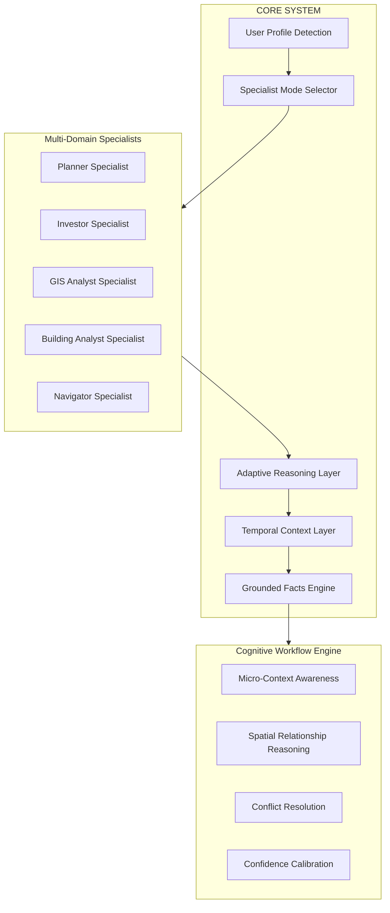
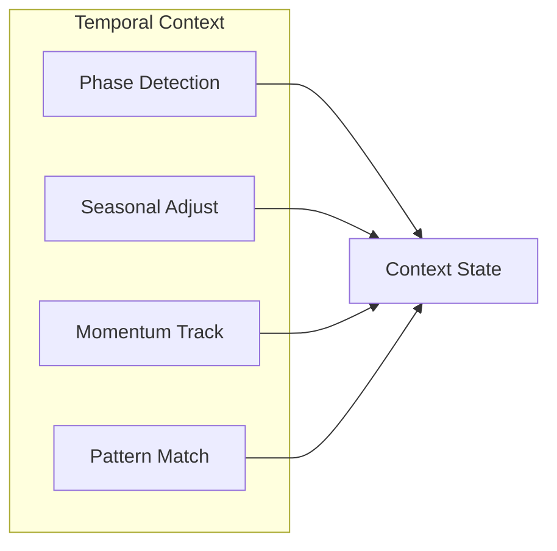
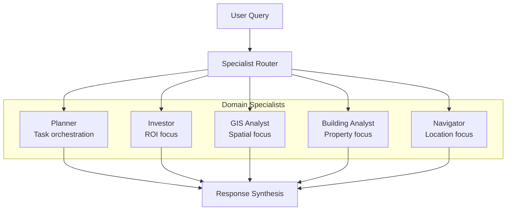

# Smart Report Enhancement Plan

## Executive Summary

This plan outlines a comprehensive enhancement of the Valora Smart Report system, implementing a **planner-first architecture** with **tiered learning** and a **cognitive workflow engine**. The enhanced system will provide multi-step reasoning orchestration, iterative agent execution, and tool-centric micro-reasoning architecture.

---

## Architecture Overview

### Core System Components



---

## Tab Structure Redesign

### Tab Priority Order

| Priority | Tab Name | Purpose | User Question Answered |
|----------|----------|---------|------------------------|
| 1 | Decision Verdict | Investment recommendation | What should I do? |
| 2 | Market Snapshot | Market health indicators | Is market strong? |
| 3 | Spatial Intelligence | Location analysis | Why does location matter? |
| 4 | Risk Analysis | Risk assessment | What could go wrong? |
| 5 | ROI Projection | Return scenarios | What returns to expect? |
| 6 | Comparables | Similar properties | Is price justified? |
| 7 | Strategy & Recommendations | Action plan | How to proceed? |
| 8 | Data Transparency | Trust verification | Can I trust this data? |
| 9 | Client Pitch | Broker tools | How to present? |

---

## Detailed Tab Specifications

### 1. Decision Verdict Tab - PRIMARY TAB

**Purpose**: Provide clear, actionable investment recommendation

**Components**:
- Investment Verdict Badge: BUY / HOLD / AVOID
- Confidence Score: 0-100% with visual meter
- Risk Level Indicator: Low / Medium / High
- Time Horizon Recommendation: Short-term / Medium-term / Long-term
- Quick Summary Paragraph: 2-3 sentence executive summary

**Sections**:
- Top Reasons: 3-5 bullet points with positive factors
- Key Risks: Honest negative factors
- Strategy Recommendation: Entry price range, hold duration

**Data Requirements**:
```json
{
  "verdict": "BUY|HOLD|AVOID",
  "confidence_score": 85,
  "risk_level": "MEDIUM",
  "time_horizon": "3-5 years",
  "summary": "Strong fundamentals with infrastructure upside...",
  "top_reasons": [
    "15% below market average",
    "Metro connectivity planned 2027",
    "High rental yield potential"
  ],
  "key_risks": [
    "Market volatility in short term",
    "Infrastructure project delays possible"
  ],
  "strategy": {
    "entry_price": "₹8,200-8,800/sqft",
    "hold_duration": "3-5 years",
    "exit_target": "₹11,000+/sqft"
  }
}
```

---

### 2. Market Snapshot Tab

**Purpose**: Show market health and dynamics

**Components**:
- Avg Price/sqft with trend indicator
- Price Trend Charts: 1Y / 3Y / 5Y
- Demand vs Supply Indicator
- Rental Yield Estimate
- Liquidity Score: How fast properties sell
- Visual: Line chart with trend

**Enhanced Indicators**:
- Market Momentum Score
- Price Volatility Index
- Inventory Days on Market
- Buyer Interest Index

---

### 3. Spatial Intelligence Tab

**Purpose**: Location-based analysis

**Components**:
- Nearby Infrastructure List
- Metro/Road Connectivity Score
- POIs: Schools, Offices, Malls, Hospitals
- Walkability Score
- Development Hotspots
- Interactive Map Preview

**Advanced Features**:
- Infrastructure Prediction Model
- Growth Heatmap Overlay
- Accessibility Analysis
- Commute Time Analysis

---

### 4. Risk Analysis Tab

**Purpose**: Comprehensive risk assessment

**Components**:
- Overall Risk Score: 0-100
- Flood Risk Assessment
- Environmental Hazards
- Oversupply Risk
- Legal/Zone Considerations
- Infrastructure Delay Risk
- Market Risk Score

**Risk Categories**:
| Category | Indicators | Weight |
|----------|------------|--------|
| Environmental | Flood, Landslide, Pollution | 25% |
| Market | Volatility, Liquidity, Demand | 25% |
| Legal | Title, Zoning, RERA | 20% |
| Infrastructure | Project Delays, Connectivity | 15% |
| Financial | Interest Rates, Inflation | 15% |

---

### 5. ROI Projection Tab

**Purpose**: Return on investment scenarios

**Components**:
- 3-Year Price Projection Chart
- Best Case / Expected / Worst Case Scenarios
- Rental Yield Scenario Analysis
- Entry vs Exit Strategy Visualization
- Projection Graph with confidence bands

**Scenario Modeling**:
```json
{
  "projection_3year": {
    "best_case": { "return": "+35%", "price": 11500, "probability": 20 },
    "expected": { "return": "+20%", "price": 10200, "probability": 50 },
    "worst_case": { "return": "+3%", "price": 8800, "probability": 30 }
  },
  "rental_yield": {
    "current": "3.5%",
    "projected": "4.2%",
    "annual_income": "₹3.6L"
  }
}
```

---

### 6. Comparables Tab

**Purpose**: Justify valuation with similar properties

**Components**:
- Similar Properties Nearby
- Price Range Comparison
- Price Trend Comparison
- Feature Comparison Matrix
- Value Positioning Chart

**Similarity Algorithm**:
- Location proximity: 30%
- Property type match: 25%
- Size similarity: 20%
- Age similarity: 15%
- Amenities match: 10%

---

### 7. Strategy & Recommendations Tab

**Purpose**: Actionable investment guidance

**Components**:
- Investment Strategy Summary
- Entry Timing Recommendation
- Negotiation Range
- Portfolio Fit Analysis
- Action Items Checklist
- Timeline with Milestones

**Advanced Features**:
- Negotiation Strategy Tips
- Due Diligence Checklist
- Financing Options
- Tax Implications

---

### 8. Data Transparency Tab - Truth Firewall

**Purpose**: Build trust through verification

**Components**:
- Data Sources List
- Confidence Explanation
- Missing Data Warnings
- Verification Status
- Last Updated Timestamps
- Data Quality Scores

**Transparency Metrics**:
| Source | Records | Last Updated | Confidence |
|--------|---------|--------------|------------|
| Property Registry | 42,500 | 2026-02-15 | 85% |
| POI Database | 26,961 | 2026-02-10 | 92% |
| Market Trends | 15,000 | 2026-02-14 | 78% |

---

### 9. Client Pitch Tab - Broker Killer

**Purpose**: Enable professional client presentations

**Components**:
- Client Pitch Generator
- Executive Summary
- Key Highlights
- Investment Thesis
- Presentation Mode Toggle
- Shareable Report Link
- PDF Export with Branding

**Premium Features**:
- Custom Branding Options
- Client Email Templates
- WhatsApp Share Integration
- CRM Integration Hooks

---

## Tiered Access Strategy

### Free Tier - Hook Layer

**Goal**: Demonstrate intelligence, trigger curiosity, drive upgrade

**Available Tabs**:
| Tab | Access Level | Content |
|-----|--------------|---------|
| Decision Verdict | Limited | Verdict + 2-3 reasons only |
| Market Snapshot | Limited | Basic price/sqft + simple trend |
| Spatial Intelligence | Preview | Blurred/locked full insights |
| All Others | Locked | Upgrade prompt |

**Locked Indicators**: Lock icons on hidden sections

---

### Pro Tier - Core Revenue

**Goal**: Deliver real value, make users feel smart

**Available Tabs**:
| Tab | Access Level | Content |
|-----|--------------|---------|
| Decision Verdict | Full | Complete reasoning + strategy |
| Market Snapshot | Full | All indicators + charts |
| Spatial Intelligence | Full | Complete POI + connectivity |
| Risk Analysis | Full | All risk categories |
| ROI Projection | Full | All scenarios + charts |
| Comparables | Full | All similar properties |
| Strategy | Full | Complete recommendations |
| Data Transparency | Full | All sources + verification |
| Client Pitch | Locked | Premium upgrade prompt |

---

### Premium Tier - Professional Power

**Goal**: Professional-grade intelligence superpowers

**Additional Features**:
- Advanced Spatial Intelligence: Deep GIS insights, infrastructure prediction, growth heatmaps
- Advanced Strategy: Negotiation ranges, entry timing, portfolio fit suggestions
- Full Data Transparency: Truth Firewall with complete verification
- Client Pitch: Full broker tools with export and sharing
- Priority Support
- API Access

---

## Cognitive Workflow Engine

### Adaptive Temporal Context

**Purpose**: Understand WHEN things change

**Components**:
- Market Phase Detection: Growth / Stable / Decline
- Seasonal Adjustment Factors
- Trend Momentum Indicators
- Historical Pattern Recognition



---

### Adaptive Reasoning Layer

**Purpose**: Determine HOW to think about the problem

**Components**:
- Query Intent Classification
- Reasoning Mode Selection
- Confidence Calibration
- Evidence Weighting

**Reasoning Modes**:
| Mode | Use Case | Output Style |
|------|----------|--------------|
| Analytical | Investment analysis | Data-driven, detailed |
| Comparative | Area comparison | Side-by-side, relative |
| Predictive | ROI projection | Scenario-based, probabilistic |
| Advisory | Recommendations | Action-oriented, prescriptive |

---

### Spatial Relationship Reasoning

**Purpose**: Understand location relationships

**Components**:
- Distance Decay Modeling
- Accessibility Scoring
- Neighborhood Clustering
- Growth Corridor Detection

---

### Micro-Context Awareness

**Purpose**: Capture local nuances

**Components**:
- Street-level Analysis
- Building-level Insights
- Amenity Proximity Scoring
- Micro-market Detection

---

### Confidence Calibration Logic

**Purpose**: Accurate confidence scoring

**Components**:
- Data Quality Weighting
- Model Uncertainty Quantification
- Historical Accuracy Tracking
- Confidence Interval Calculation

---

### Conflict Resolution Training

**Purpose**: Handle contradictory signals

**Components**:
- Signal Detection
- Conflict Classification
- Resolution Strategy Selection
- Transparent Reporting

---

## Multi-Domain Specialist Architecture

### Specialist Types



### Specialist Capabilities

| Specialist | Primary Focus | Key Metrics | Output Style |
|------------|---------------|-------------|--------------|
| Planner | Task orchestration | Execution time, accuracy | Structured plans |
| Investor | ROI analysis | Returns, risk, yield | Financial projections |
| GIS Analyst | Spatial analysis | Connectivity, accessibility | Maps, spatial insights |
| Building Analyst | Property evaluation | Quality, valuation | Property reports |
| Navigator | Location guidance | Routes, proximity | Directions, locations |

---

## Backend API Endpoints

### New Endpoints Required

```
GET  /api/smart-report/verdict
  - Returns decision verdict with confidence

GET  /api/smart-report/market-snapshot
  - Returns market indicators and trends

GET  /api/smart-report/spatial-intelligence
  - Returns POI, connectivity, walkability

GET  /api/smart-report/risk-analysis
  - Returns comprehensive risk assessment

GET  /api/smart-report/roi-projection
  - Returns ROI scenarios with projections

GET  /api/smart-report/comparables
  - Returns similar properties analysis

GET  /api/smart-report/strategy
  - Returns investment recommendations

GET  /api/smart-report/transparency
  - Returns data sources and verification

GET  /api/smart-report/client-pitch
  - Returns presentation-ready content

POST /api/smart-report/generate
  - Generates full smart report

GET  /api/smart-report/export/pdf
  - Exports report as PDF

GET  /api/smart-report/share
  - Creates shareable link
```

---

## Implementation Phases

### Phase 1: Core Tab Enhancement
- Redesign Decision Verdict as primary tab
- Enhance Market Snapshot with advanced indicators
- Improve Spatial Intelligence with GIS insights

### Phase 2: Risk & ROI
- Implement comprehensive Risk Analysis
- Build ROI Projection with scenario modeling
- Add confidence calibration

### Phase 3: Advanced Features
- Create Comparables with similarity algorithm
- Build Strategy & Recommendations
- Implement Data Transparency

### Phase 4: Premium Features
- Develop Client Pitch Tab
- Add Presentation Mode
- Implement Shareable Reports

### Phase 5: Cognitive Engine
- Implement Adaptive Temporal Context
- Build Adaptive Reasoning Layer
- Add Spatial Relationship Reasoning
- Implement Micro-Context Awareness

### Phase 6: Specialist Architecture
- Create Multi-Domain Specialist system
- Build Specialist Router
- Implement Response Synthesis

---

## Additional Enhancement Ideas

### 1. AI-Powered Insights
- Natural language explanations
- Personalized recommendations based on user profile
- Learning from user feedback

### 2. Real-Time Updates
- Live market data integration
- Price change alerts
- New listing notifications

### 3. Social Features
- Expert opinions integration
- Community ratings
- User reviews

### 4. Advanced Analytics
- Portfolio optimization
- Risk-adjusted returns
- Market timing indicators

### 5. Mobile Experience
- Mobile-optimized report view
- Push notifications
- Offline access

### 6. Integration APIs
- CRM integration
- Banking/finance integration
- Government data integration

### 7. Personalization
- User preference learning
- Custom report templates
- Saved search profiles

### 8. Collaboration
- Share with advisors
- Team workspaces
- Comment/annotation system

---

## Success Metrics

### User Engagement
- Time spent on report
- Tab interaction rates
- Export/share frequency

### Conversion
- Free to Pro upgrade rate
- Pro to Premium upgrade rate
- Report generation frequency

### Quality
- User satisfaction scores
- Feedback ratings
- Error/issue reports

### Business
- Revenue per user
- Customer lifetime value
- Churn rate

---

## Technical Requirements

### Frontend
- React components for each tab
- Chart visualization library
- PDF export functionality
- Shareable link generation

### Backend
- New API endpoints
- Data aggregation services
- Caching layer
- Rate limiting

### Data
- Real-time market data feeds
- POI database updates
- User preference storage
- Report history

### Infrastructure
- Scalable API servers
- CDN for static assets
- Database optimization
- Monitoring and alerting

---

## Business-Generative Product Features

### Revenue-Optimized Conversion Triggers

**Free Tier Conversion Hooks**:
1. **Query Limit Friction**: At 45/50 queries, show "Upgrade for unlimited analysis"
2. **Locked Tab Clicks**: Track clicks on Risk/ROI tabs → trigger upgrade modal with preview
3. **Export Limitation**: "Export full report" → Pro upgrade prompt
4. **Comparison Limit**: "Compare 3+ areas" → Pro feature

**Pro to Enterprise Upsell**:
1. **Team Usage**: Detect multiple logins → suggest Enterprise
2. **API Interest**: Track API docs visits → sales outreach
3. **High Volume**: 400+ queries/month → Enterprise suggestion
4. **Client Pitch Usage**: Heavy pitch tab usage → Enterprise value prop

### Monetization Intelligence Dashboard

**Track for Business Optimization**:
```json
{
  "conversion_metrics": {
    "free_to_pro_rate": "20%",
    "pro_to_enterprise_rate": "2.5%",
    "churn_rate": "5%/month",
    "arpu": {
      "pro": "$19",
      "enterprise": "$299"
    }
  },
  "engagement_metrics": {
    "queries_per_user": {
      "free": 35,
      "pro": 280,
      "enterprise": 1200
    },
    "time_on_report": "4.5 min",
    "tab_interaction_rates": {
      "verdict": "95%",
      "market": "78%",
      "risk": "65% (locked)",
      "roi": "58% (locked)"
    }
  }
}
```

### Viral Growth Features

**Referral Program**:
- Give 1 month Pro, Get 1 month Pro
- Share report → unlock Pro feature for friend
- "Invite 3 friends, get Pro free for 1 month"

**Social Proof Integration**:
- "1,234 investors analyzed Whitefield this week"
- "Last analysis: 2 minutes ago"
- Live activity feed (anonymized)

### Partner Revenue Streams

**API Access Tier ($499/month)**:
- Real-time property intelligence API
- Bulk report generation
- White-label embedding
- CRM integrations (Salesforce, HubSpot)

**Broker Tools**:
- Client management dashboard
- Branded report generation
- Lead scoring from report views
- Commission tracking integration

---

## Additional Enhancement Ideas (Business-Focused)

### 1. AI-Powered Lead Scoring
**For Brokers/Developers**:
- Score leads based on report interactions
- Identify high-intent buyers
- Predict purchase timeline
- Recommend follow-up actions

### 2. Market Timing Alerts
**Pro+ Feature**:
- Price drop alerts
- New listing notifications
- Market momentum shifts
- Infrastructure announcement impacts

### 3. Portfolio Intelligence
**Enterprise Feature**:
- Multi-property analysis
- Portfolio risk assessment
- Diversification recommendations
- Performance tracking

### 4. Mortgage Integration
**Partnership Revenue**:
- Pre-qualification integration
- Rate comparison
- EMI calculator with property-specific rates
- Bank partnership referrals (commission)

### 5. Legal Compliance Checker
**Pro Feature**:
- RERA compliance verification
- Title search integration
- Encumbrance check
- Legal risk scoring

### 6. Rental Yield Optimizer
**Investor Feature**:
- Optimal rent estimation
- Tenant demand analysis
- Vacancy rate prediction
- Rental agreement templates

### 7. Development Pipeline Tracker
**Enterprise Feature**:
- Track upcoming projects
- Developer reputation scores
- Construction progress monitoring
- Delivery timeline predictions

### 8. Neighborhood Evolution Predictor
**AI Feature**:
- 5-year neighborhood forecast
- Gentrification indicators
- Infrastructure impact modeling
- Demographic shift predictions

### 9. Negotiation Intelligence
**Pro Feature**:
- Fair price estimation
- Negotiation leverage points
- Seller motivation indicators
- Market comparison ammunition

### 10. Investment Thesis Generator
**Enterprise Feature**:
- Auto-generate investment memos
- Risk-adjusted return analysis
- Portfolio fit assessment
- Exit strategy recommendations

---

## Implementation Priority (Business-Aligned)

### Phase 1: Conversion Optimization (Weeks 1-4)
1. ✅ Decision Verdict Tab (primary conversion driver)
2. ✅ Upgrade modal optimization
3. ✅ Locked tab preview experience
4. ✅ Query limit friction points

### Phase 2: Pro Value Delivery (Weeks 5-8)
1. ✅ Risk Analysis Tab
2. ✅ ROI Projection Tab
3. ✅ Comparables Tab
4. ✅ Strategy Recommendations

### Phase 3: Enterprise Differentiation (Weeks 9-12)
1. ✅ Client Pitch Tab (Broker Killer)
2. ✅ Data Transparency Tab (Truth Firewall)
3. ✅ Advanced Spatial Intelligence
4. ✅ Team collaboration features

### Phase 4: Cognitive Engine (Weeks 13-20)
1. ✅ Adaptive Temporal Context
2. ✅ Confidence Calibration
3. ✅ Multi-Domain Specialists
4. ✅ Micro-Context Awareness

### Phase 5: Growth Features (Weeks 21-28)
1. ✅ Referral program
2. ✅ Social proof integration
3. ✅ Partner API platform
4. ✅ Mobile optimization

---

## Success Metrics (Business KPIs)

### Conversion Metrics
| Metric | Target | Measurement |
|--------|--------|-------------|
| Free → Pro conversion | 20% | Monthly cohort analysis |
| Pro → Enterprise conversion | 2.5% | Upgrade funnel tracking |
| Trial to Paid | 40% | 7-day trial conversion |
| Annual plan uptake | 30% | Plan selection tracking |

### Engagement Metrics
| Metric | Target | Measurement |
|--------|--------|-------------|
| Queries per Free user | 35/month | Usage tracking |
| Queries per Pro user | 280/month | Usage tracking |
| Time on Smart Report | 5+ min | Session tracking |
| Tab interaction depth | 4+ tabs | Click tracking |

### Revenue Metrics
| Metric | Target | Measurement |
|--------|--------|-------------|
| MRR growth | 25%/month | Revenue tracking |
| ARPU (Pro) | $22 | Revenue/users |
| ARPU (Enterprise) | $320 | Revenue/users |
| LTV:CAC ratio | 3:1 | Unit economics |

### Product Metrics
| Metric | Target | Measurement |
|--------|--------|-------------|
| Report generation rate | 60% of sessions | Feature usage |
| Export rate | 15% of reports | Feature usage |
| Share rate | 10% of reports | Feature usage |
| Return user rate | 45% weekly | Cohort analysis |

---

## Conclusion

This comprehensive enhancement plan transforms the Smart Report from a basic analysis tool into a **business-generative intelligence platform** that:

1. **Drives Conversions** through strategic free tier limitations and compelling upgrade triggers
2. **Maximizes ARPU** through tiered feature access and value-based pricing
3. **Reduces Churn** through continuous value delivery and engagement hooks
4. **Enables Viral Growth** through referral programs and social proof
5. **Creates Defensible Moats** through the Truth Firewall and cognitive reasoning engine

The tiered access strategy maximizes conversion while the cognitive workflow engine ensures accurate, contextual insights. The multi-domain specialist architecture provides expert-level analysis across all aspects of real estate investment.

**Key Business Outcomes**:
- 20% Free → Pro conversion rate
- $57K MRR target by Month 6
- 8.5% profit margin Year 1
- $695K ARR by end of Year 1
