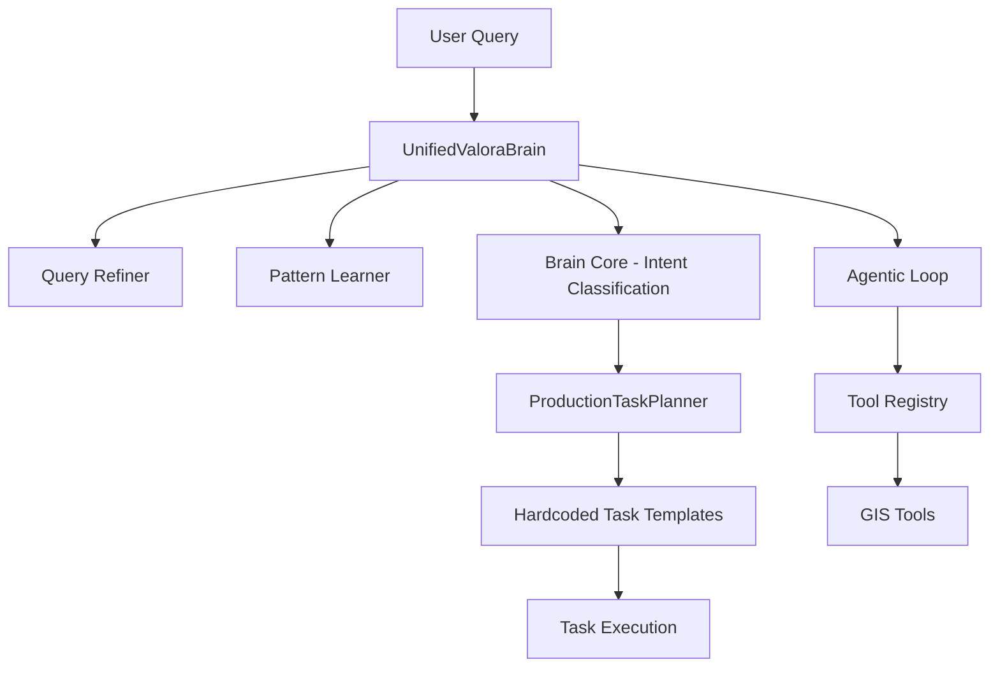
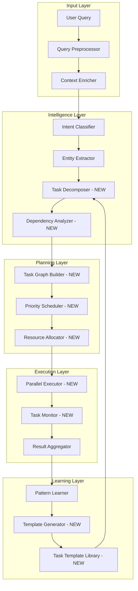
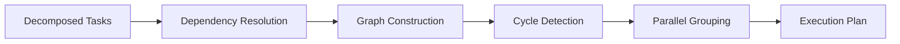

# Task Generation System Upgrade Plan

## Executive Summary

This document outlines a comprehensive upgrade to Valora's task generation system, transforming it from a template-based approach to a professional, NLP-driven task orchestration engine.

---

## Current Architecture Analysis

### Components Overview



### Current Implementation

| Component | File | Purpose | Limitation |
|-----------|------|---------|------------|
| ProductionTaskPlanner | `ai/production_task_planner.py` | Creates task plans | Hardcoded templates |
| AgenticLoop | `ai/agentic_loop.py` | Think-Act-Observe cycle | Max 5 steps, sequential |
| UnifiedValoraBrain | `ai/unified_valora_brain.py` | Orchestrates all components | Limited task intelligence |
| ToolRegistry | `ai/tools_registry.py` | GIS tool management | Static tool definitions |

### Key Limitations

1. **Hardcoded Task Templates**: Tasks defined via if-else blocks
2. **No NLP Task Extraction**: Cannot dynamically generate tasks from queries
3. **Sequential Execution**: No parallel task execution
4. **Simple Dependencies**: Linear dependency lists, not DAG
5. **Limited Learning**: Pattern learning exists but underutilized

---

## Proposed Architecture

### High-Level Design



### New Components

#### 1. Task Decomposer
**Purpose**: Extract actionable tasks from natural language using NLP

```python
@dataclass
class DecomposedTask:
    id: str
    action: str              # e.g., search, analyze, compare, navigate
    entity: str              # e.g., property, area, POI
    parameters: Dict[str, Any]
    confidence: float
    source_span: str         # Original text that generated this task
    dependencies: List[str]  # Task IDs this depends on
```

**Implementation Approach**:
- Use LLM to identify action verbs and entities
- Map actions to tool capabilities
- Extract parameters from context

#### 2. Dependency Analyzer
**Purpose**: Build proper DAG for task dependencies

```python
class TaskDependencyGraph:
    def __init__(self):
        self.nodes: Dict[str, Task] = {}
        self.edges: Dict[str, Set[str]] = {}  # task_id -> dependent task ids
        
    def add_task(self, task: Task):
        pass
        
    def detect_cycles(self) -> bool:
        pass
        
    def topological_sort(self) -> List[List[Task]]:
        # Returns tasks grouped by execution level
        pass
        
    def get_parallel_tasks(self) -> List[List[Task]]:
        # Returns tasks that can run concurrently
        pass
```

#### 3. Task Graph Builder
**Purpose**: Construct execution graph from decomposed tasks



#### 4. Priority Scheduler
**Purpose**: Intelligent task prioritization

**Priority Factors**:
- User intent criticality
- Task dependencies
- Resource requirements
- Historical execution time
- Cache availability

#### 5. Parallel Executor
**Purpose**: Execute independent tasks concurrently

```python
class ParallelTaskExecutor:
    def __init__(self, max_concurrent: int = 4):
        self.semaphore = asyncio.Semaphore(max_concurrent)
        
    async def execute_graph(self, graph: TaskDependencyGraph) -> List[TaskResult]:
        # Execute tasks level by level
        for level in graph.get_parallel_tasks():
            results = await asyncio.gather(*[
                self._execute_with_semaphore(task)
                for task in level
            ])
        return results
```

#### 6. Task Monitor
**Purpose**: Real-time task progress tracking

**Metrics Tracked**:
- Task status: pending, running, completed, failed
- Execution time vs estimated
- Resource usage
- Error rates
- Cache hit rates

#### 7. Template Generator
**Purpose**: Auto-generate task templates from successful executions

**Process**:
1. Analyze successful task sequences
2. Extract common patterns
3. Parameterize templates
4. Store in template library

#### 8. Task Template Library
**Purpose**: Reusable, parameterized task templates

```python
@dataclass
class TaskTemplate:
    id: str
    name: str
    description: str
    intent_patterns: List[str]      # Regex patterns for intent matching
    parameter_schema: Dict          # JSON schema for parameters
    task_sequence: List[TaskSpec]   # Parameterized task definitions
    success_rate: float
    avg_duration_ms: int
    last_used: datetime
```

---

## Implementation Plan

### Phase 1: Foundation - Task Graph Infrastructure

**Files to Create**:
- `backend/ai/task_graph.py` - TaskDependencyGraph implementation
- `backend/ai/task_templates.py` - TaskTemplate and TemplateLibrary

**Files to Modify**:
- `backend/ai/production_task_planner.py` - Add graph-based planning

**Tasks**:
- [ ] Implement TaskDependencyGraph with DAG support
- [ ] Add cycle detection algorithm
- [ ] Implement topological sort for execution ordering
- [ ] Create TaskTemplate dataclass
- [ ] Build TemplateLibrary with CRUD operations

### Phase 2: Intelligence - NLP Task Decomposition

**Files to Create**:
- `backend/ai/task_decomposer.py` - NLP-based task extraction
- `backend/ai/decomposition_prompts.py` - LLM prompts for decomposition

**Files to Modify**:
- `backend/ai/unified_valora_brain.py` - Integrate decomposer

**Tasks**:
- [ ] Design decomposition prompts for LLM
- [ ] Implement TaskDecomposer class
- [ ] Map extracted actions to tool capabilities
- [ ] Handle ambiguous decompositions
- [ ] Add confidence scoring

### Phase 3: Execution - Parallel Processing

**Files to Create**:
- `backend/ai/parallel_executor.py` - Concurrent task execution
- `backend/ai/task_monitor.py` - Progress tracking

**Files to Modify**:
- `backend/ai/production_task_planner.py` - Use parallel executor

**Tasks**:
- [ ] Implement ParallelTaskExecutor with semaphore
- [ ] Add asyncio.gather for concurrent execution
- [ ] Implement TaskMonitor with metrics
- [ ] Add streaming progress events
- [ ] Handle partial failures gracefully

### Phase 4: Learning - Template Generation

**Files to Create**:
- `backend/ai/template_generator.py` - Auto-template creation

**Files to Modify**:
- `backend/ai/pattern_learner.py` - Enhanced pattern learning
- `backend/ai/production_task_planner.py` - Use generated templates

**Tasks**:
- [ ] Analyze successful task sequences
- [ ] Extract parameterizable patterns
- [ ] Generate templates automatically
- [ ] Store templates with metadata
- [ ] Implement template matching for new queries

### Phase 5: Integration - Unified Brain Update

**Files to Modify**:
- `backend/ai/unified_valora_brain.py` - Full integration
- `backend/routes/chat_routes.py` - Streaming updates

**Tasks**:
- [ ] Wire new components into UnifiedValoraBrain
- [ ] Update streaming events for task progress
- [ ] Add admin endpoints for template management
- [ ] Update health check endpoints
- [ ] Add telemetry for task execution

---

## API Changes

### New Endpoints

```python
# Task Template Management
GET  /api/tasks/templates              # List all templates
POST /api/tasks/templates              # Create custom template
GET  /api/tasks/templates/{id}         # Get template details
PUT  /api/tasks/templates/{id}         # Update template
DELETE /api/tasks/templates/{id}       # Delete template

# Task Execution Monitoring
GET  /api/tasks/execution/{id}         # Get execution status
GET  /api/tasks/execution/{id}/graph   # Get dependency graph
GET  /api/tasks/metrics                # Get execution metrics

# Task Decomposition
POST /api/tasks/decompose              # Decompose query to tasks
```

### Enhanced Streaming Events

```json
// Task decomposition event
{
  "type": "task_decomposition",
  "tasks": [
    {"action": "search", "entity": "property", "confidence": 0.95},
    {"action": "analyze", "entity": "area", "confidence": 0.87}
  ]
}

// Parallel execution event
{
  "type": "parallel_execution",
  "level": 1,
  "tasks": ["t1_geocode", "t2_parse"],
  "status": "running"
}

// Task graph event
{
  "type": "task_graph",
  "nodes": [...],
  "edges": [...],
  "parallel_groups": [[...], [...]]
}
```

---

## Configuration

### New Configuration Options

```python
# backend/config.py additions
class TaskConfig:
    # Parallel execution
    MAX_CONCURRENT_TASKS = 4
    TASK_TIMEOUT_SECONDS = 30
    
    # Decomposition
    DECOMPOSITION_CONFIDENCE_THRESHOLD = 0.7
    MAX_TASKS_PER_QUERY = 10
    
    # Learning
    TEMPLATE_MIN_SUCCESS_RATE = 0.8
    TEMPLATE_MIN_EXECUTIONS = 5
    
    # Monitoring
    TASK_METRICS_RETENTION_DAYS = 30
```

---

## Testing Strategy

### Unit Tests
- TaskDependencyGraph cycle detection
- Topological sort correctness
- Template matching accuracy
- Decomposition confidence scoring

### Integration Tests
- End-to-end task execution
- Parallel execution correctness
- Template generation from executions
- Streaming event flow

### Performance Tests
- Concurrent task execution benchmarks
- Memory usage under load
- Decomposition latency

---

## Migration Path

### Backward Compatibility
1. Keep existing hardcoded templates as fallback
2. New system runs in parallel initially
3. A/B test new vs old task generation
4. Gradual rollout with feature flags

### Feature Flags
```python
FEATURE_FLAGS = {
    "nlp_task_decomposition": False,  # Enable NLP decomposition
    "parallel_task_execution": False,  # Enable parallel execution
    "auto_template_generation": False, # Enable auto templates
}
```

---

## Success Metrics

| Metric | Current | Target |
|--------|---------|--------|
| Task generation accuracy | 70% | 95% |
| Average execution time | 2.5s | 1.5s |
| Parallel task utilization | 0% | 60% |
| Template reuse rate | 20% | 70% |
| Query success rate | 85% | 95% |

---

## Timeline

| Phase | Duration | Dependencies |
|-------|----------|--------------|
| Phase 1: Foundation | - | None |
| Phase 2: Intelligence | - | Phase 1 |
| Phase 3: Execution | - | Phase 1 |
| Phase 4: Learning | - | Phase 2, 3 |
| Phase 5: Integration | - | All phases |

---

## Conclusion

This upgrade transforms Valora's task generation from a simple template-based system to a professional, intelligent task orchestration engine. The key innovations are:

1. **NLP-driven decomposition** for dynamic task extraction
2. **DAG-based dependencies** for proper task ordering
3. **Parallel execution** for improved performance
4. **Auto-template generation** for continuous learning
5. **Real-time monitoring** for observability

The modular design allows incremental implementation while maintaining backward compatibility.
